# UML – PI-Food-Server

## 1. Diagrama de Clases

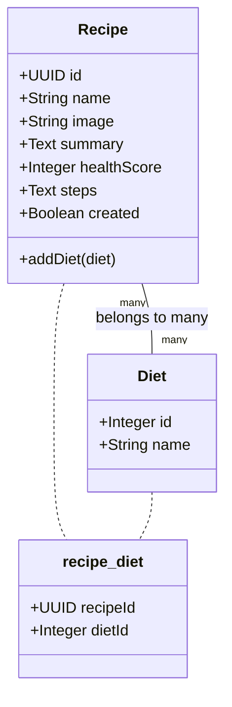

---

## 2. Diagrama Entidad-Relación (ER)

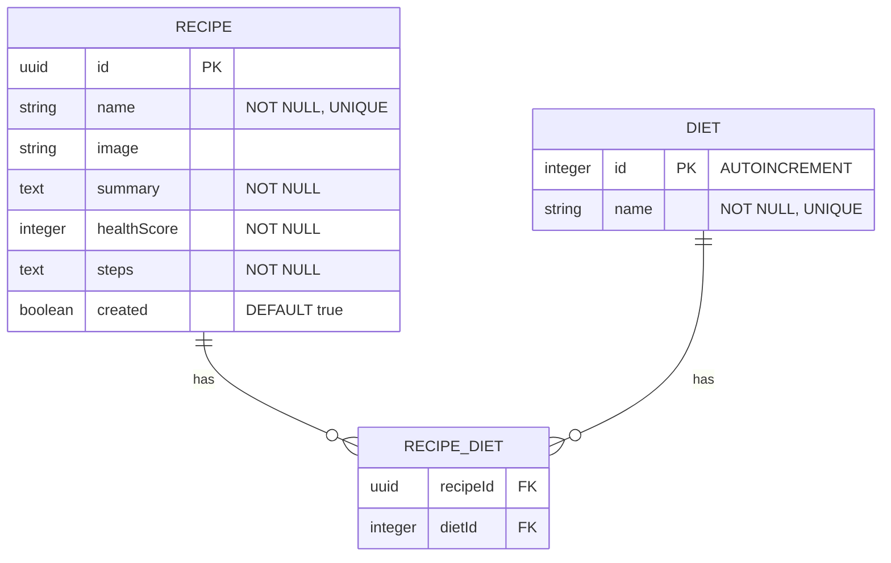

---

## 3. Diagrama de Componentes

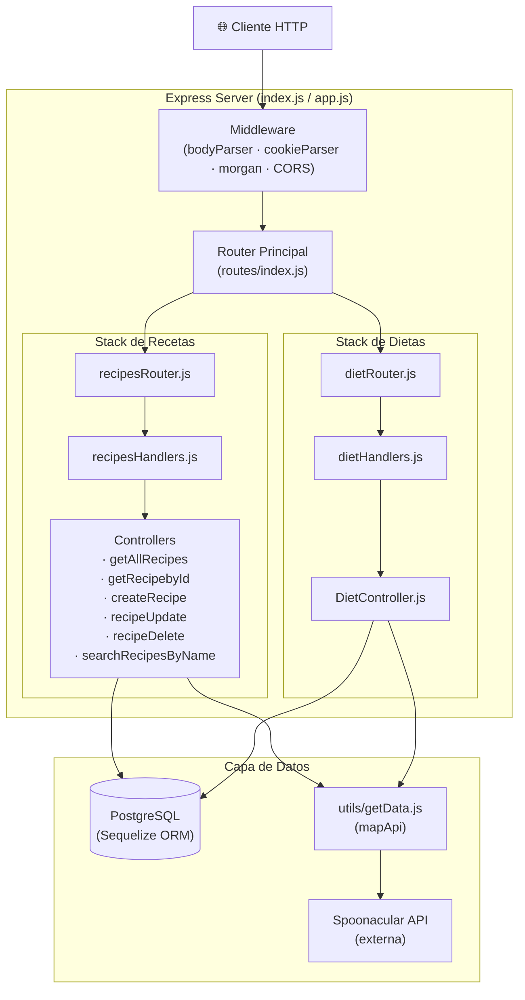

---

## 4. Diagrama de Secuencia – GET /recipes (todos)

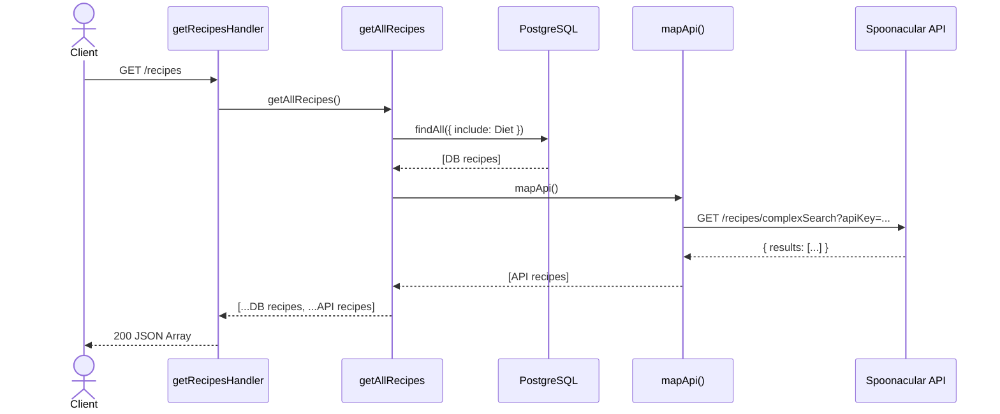

---

## 5. Diagrama de Secuencia – GET /recipes?name=query (búsqueda)

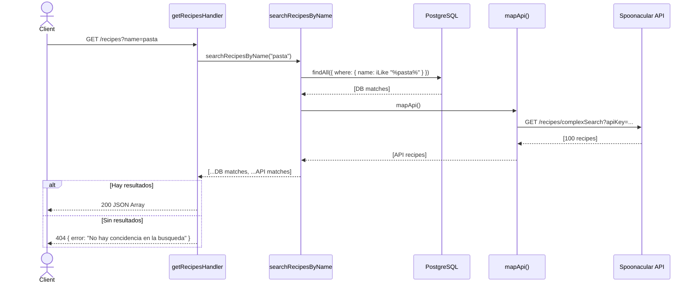

---

## 6. Diagrama de Secuencia – GET /recipes/:id

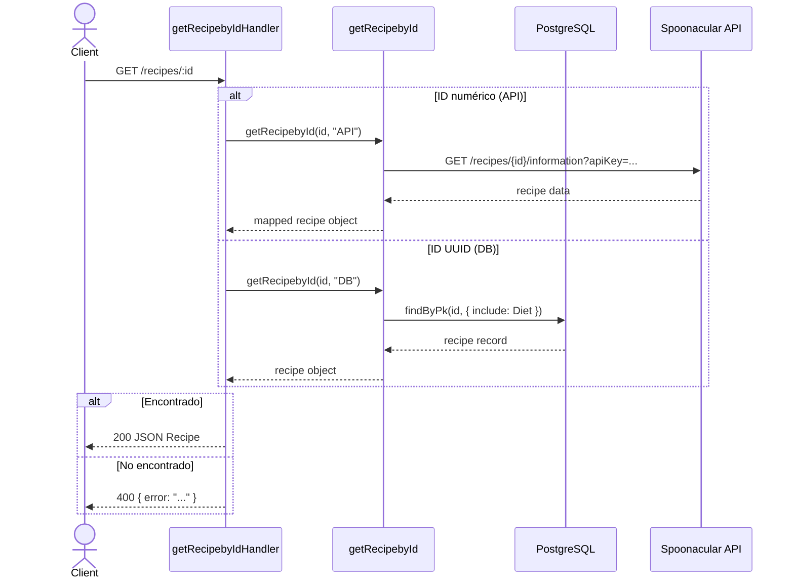

---

## 7. Diagrama de Secuencia – POST /recipes (crear)

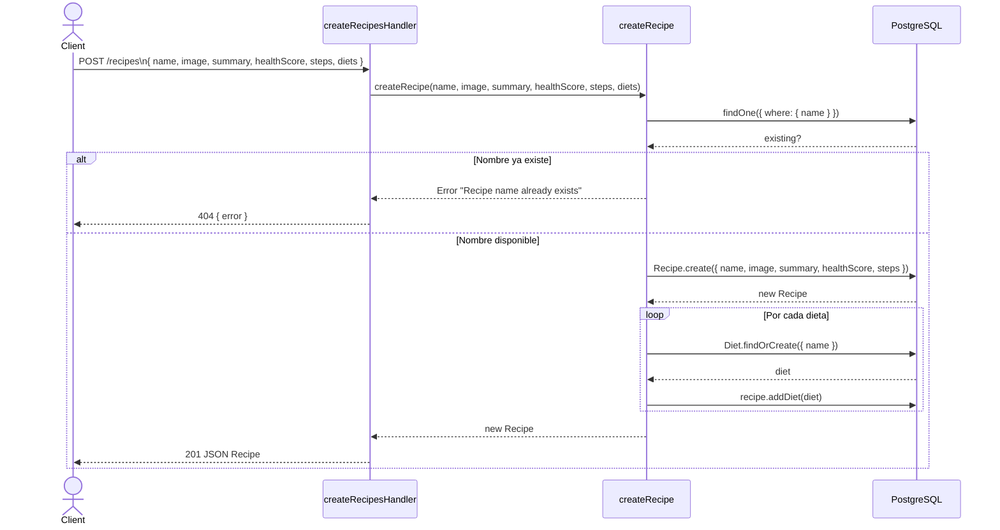

---

## 8. Diagrama de Secuencia – PUT /recipes (actualizar)

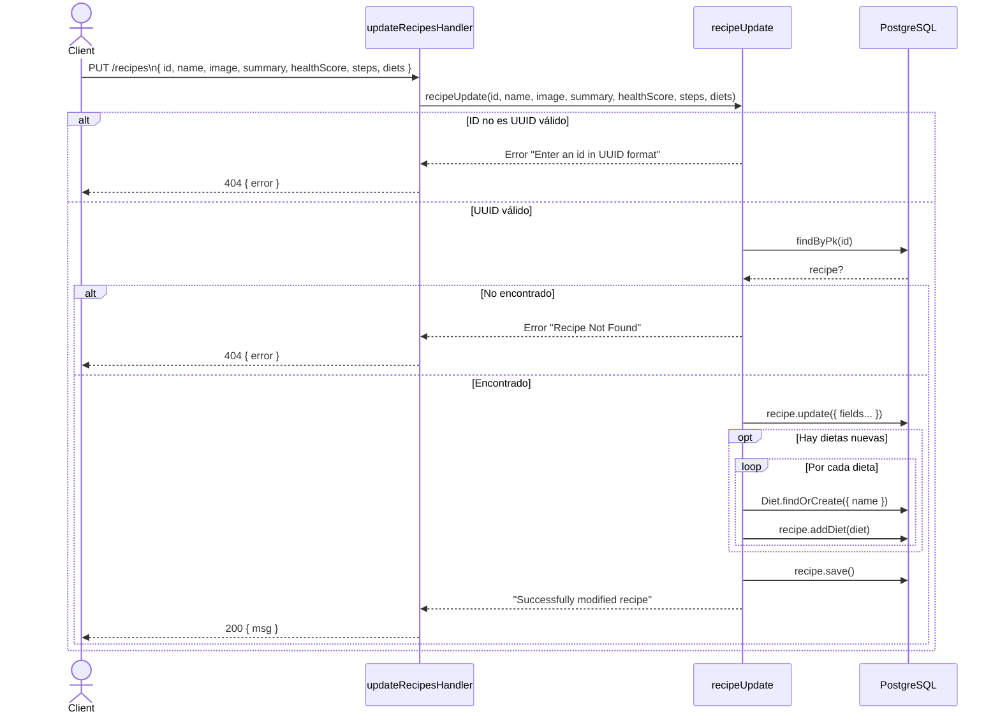

---

## 9. Diagrama de Secuencia – DELETE /recipes/:id

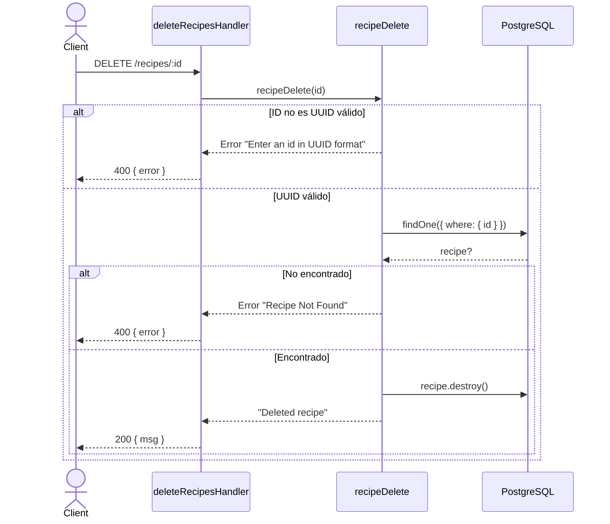

---

## 10. Diagrama de Secuencia – GET /diet

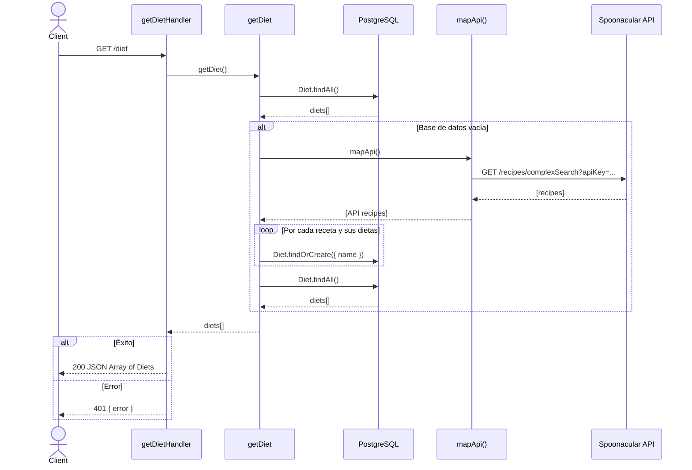

---

## 11. Diagrama de Actividad – Ciclo de vida de una petición

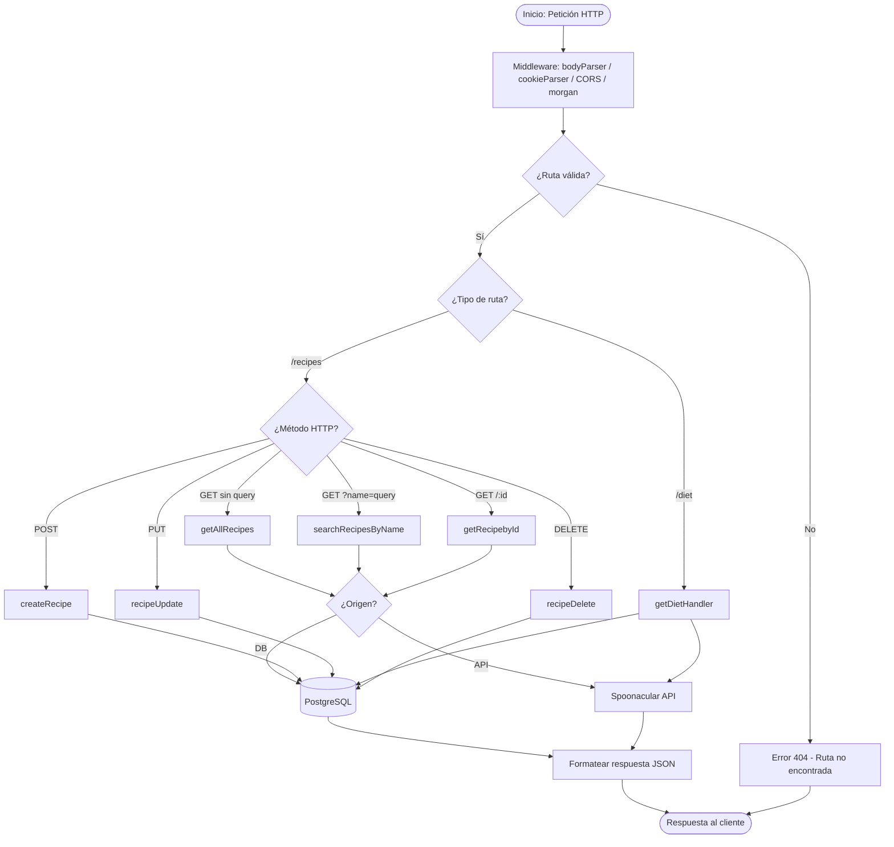
